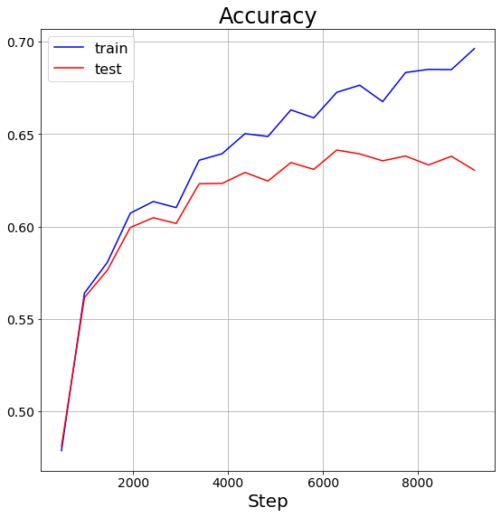
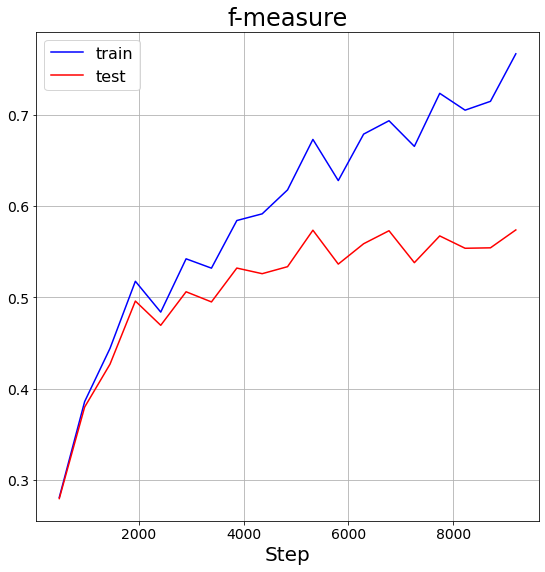
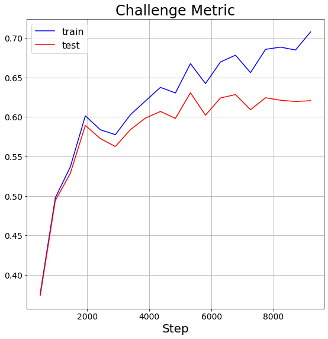
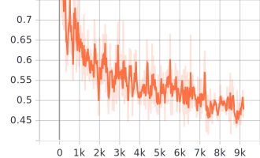

# CRNN models for ECG classification

## Experiments

NOTE: the ticks of the following plots are unable to be seen in the dark theme!

   accuracy             |  f measure          | challenge metric
:-------------------------:|:-------------------------:|:-------------------------:
  |   | 

the train loss curve

