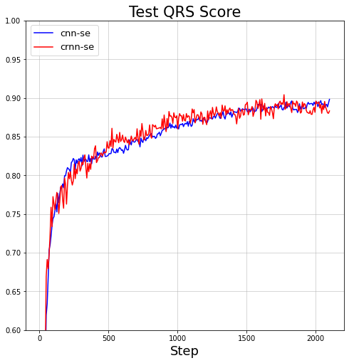
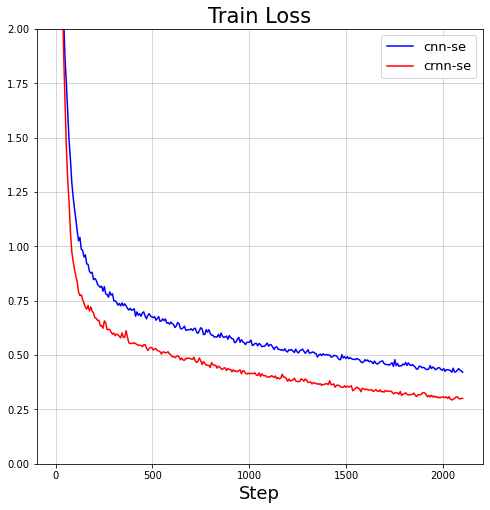

# Sequence labeling models for rpeak detection

SOTA model of CPSC2019, re-implemented using PyTorch.

Training configs can be found [here](https://github.com/wenh06/torch_ecg/blob/master/torch_ecg/train/train_seq_lab_net_cpsc2019/cfg.py), which are used to [create the model](https://github.com/wenh06/torch_ecg/blob/master/torch_ecg/train/train_seq_lab_net_cpsc2019/train.py#L448)

For usage of original trained models, refer to [this function](https://github.com/wenh06/torch_ecg/blob/master/torch_ecg/train/train_crnn_cpsc2020/signal_processing/ecg_rpeaks_dl.py#L30)

## Experiments

NOTE: the ticks of the following plots are unable to be seen in the dark theme!

test qrs score             |  train qrs score          | train epoch loss
:-------------------------:|:-------------------------:|:-------------------------:
  |   | 
