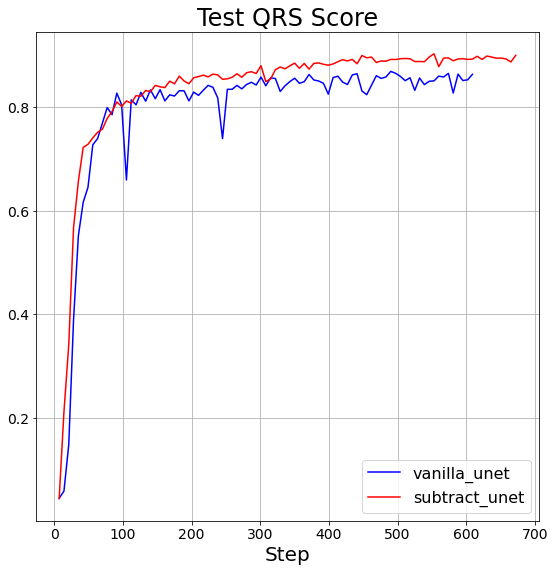
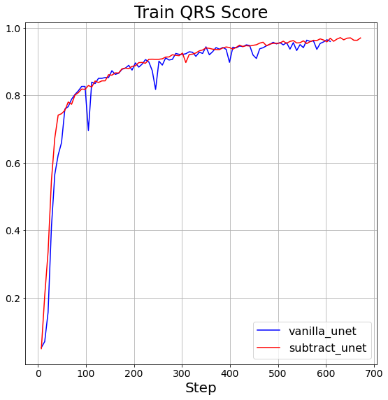

# UNet models for rpeak detection

Top 3 models of CPSC2019 challenge, along with a ``vanilla`` unet model.

## Experiments

test qrs score             |  train qrs score     
:-------------------------:|:-------------------------:
  |  
